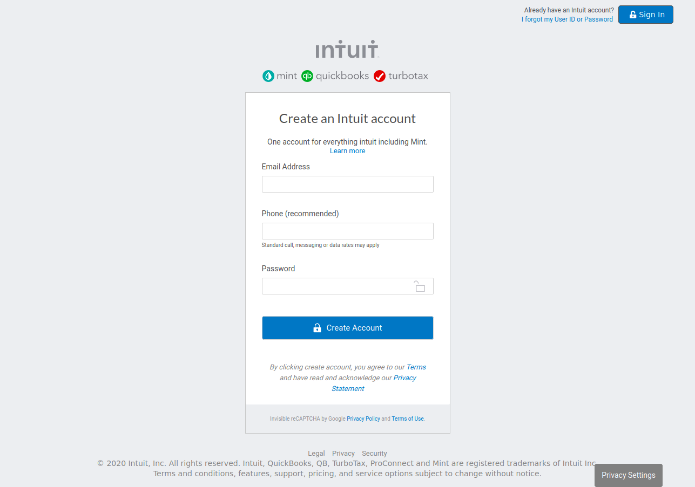

# HTML Forms

> The page is a clone of the Sign In webpage of Mint.com.

This project was made to demonstrate the authors' understanding of basic HTML and CSS concepts and their ability to work with html forms.

## Built With
- HTML
- CSS

## Live Demo

[Live Demo Link](https://rawcdn.githack.com/RNtaate/Forms-project-roy-lucas/0f35b9dacfe6fdfa2dcc6e562c240208f5c86460/index.html)

## Authors

👤 **Lucas Delbel**

- Github: [@ldelbel](https://github.com/ldelbel)
- Twitter: [@delbel_lucas](https://twitter.com/delbel_lucas)
- Linkedin: [lucasdelbel](https://linkedin.com/in/lucasdelbel)

👤 **Roy Ntaate**

- Github: [@RNtaate](https://github.com/RNtaate)
- Twitter: [@RNtaate](https://twitter.com/RNtaate)
- Linkedin: [roy-ntaate](https://linkedin.com/in/roy-ntaate)

